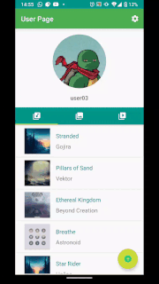
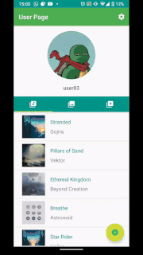
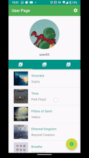
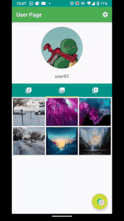
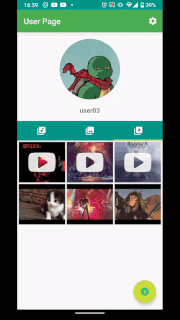
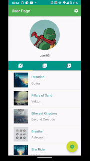

# UserTabLayout
An app that allows registering users using Firebase Authentication. Registered users can add lists of their favorite songs, photos, and videos.

## TabLayout material for easy navigation
Using TabLayout material together with ViewPagerAdapter the app can quickly navigate between fragments.



## Songs List
A recycler view displays each song's picture, name, and author. 
When you click on a specific song, a new activity displays into a webView a YoutubeMusic search for the song name and artist.
Clicking on the floating button, you can add a new song.



When you swipe on each song item, you can edit the song.
Or you can choose to delete it.



## Photos List
In this fragment, a recycler view with a grid layout displays the user's list of photos.
You can click on the image to display it on full screen. This view also creates a delete button.
Using the floating button on the main activity, you can add a new picture. Decide to take a new image with the phone camera or upload an existing one. 



(Notice how the floating button function changes depending on which fragment is currently active)

```
//set up click  listener on add button depending on the current tab
        binding.buttonAddAction.setOnClickListener {
            val position = binding.viewPager.currentItem

            when (position) {
                0 -> {
                    //Music Fragment
                    val navController = activity?.findNavController(R.id.myNavHostFragment)
                    navController?.navigate(R.id.action_homeFragment_to_add_new_song)
                }

                1 -> {
                    //Photos Fragment
                    val intent = Intent(Intent.ACTION_PICK)
                    intent.type = "image/*"
                    startActivityForResult(intent, 0)
                }

                2 -> {
                    //Videos Fragment
                    val intent1 = Intent(activity, YoutubeSearchActivity::class.java)
                    startActivity(intent1)
                }
            }

        }
        
```

## Videos List
This fragment displays the user's list of videos inside a grid layout.
When you click on each video, a webview plays the video using the YouTube Android Player API.
You can delete videos by long clicking on the video's image.

You can add a new video by clicking the floating button. This action activates a Youtube search on a new activity. When a video plays,  clicking the "save video" button will add the video to the list.  



A pattern recognition algorithm looks for the video ID inside the currently displayed URL.


```
private fun getVideoId(@NonNull videoUrl: String): String? {
        //Create patten to extract video ID
        val reg: String =
            "http(?:s)?:\\/\\/(?:m.)?(?:www\\.)?youtu(?:\\.be\\/|be\\.com\\/(?:watch\\?(?:feature=youtu.be\\&)?v=|v\\/|embed\\/|user\\/(?:[\\w#]+\\/)+))([^&#?\\n]+)"
        val pattern = Pattern.compile(reg, Pattern.CASE_INSENSITIVE);
        val matcher = pattern.matcher(videoUrl)

        if (matcher.find()) {
            return matcher.group(1)
        } else {
            return null
        }

    }
```
It also finds and uploads the video's thumbnail.
```
val videoImage = "https://img.youtube.com/vi/$videoID/0.jpg";
```


## User Settings
In this view, the user can change the profile picture, display name, email or password.
To save the changes the user must reauthenticate by entering the current email and password.



## User Registering and Login
A new user can be registered, with and email, password, username and a selected and cropped picture.


* Remember to add your own Firebase & Youtube Android Player API credentials when you test the app

## Credits
[Firebase analytics 17.5.0, auth 19.4.0, storage 19.2.0, database 19.4.0](https://firebase.google.com/docs/android/setup)

[Circle Image View 3.1.0](https://github.com/hdodenhof/CircleImageView)

[Groupie 2.8.1](https://github.com/lisawray/groupie)

[Glide 4.11.0](https://github.com/bumptech/glide)

[Glide 4.11.0](https://github.com/bumptech/glide)

[Image cropper 2.8.+](https://github.com/ArthurHub/Android-Image-Cropper)

Android Gradle plugin version: 4.0.2

Gradle version: 6.1.1


com.google.gms:google-services:4.3.3


buildToolsVersion "30.0.1"

ext.kotlin_version = "1.4.10"

supportlibVersion = '1.2.0'

navigationVersion="2.3.0"

multidex_version = "2.0.1"


Gradle dependecies
```
implementation fileTree(dir: "libs", include: ["*.jar"])
    implementation "org.jetbrains.kotlin:kotlin-stdlib:$kotlin_version"
    implementation "org.jetbrains.kotlin:kotlin-reflect:$kotlin_version"
    implementation 'androidx.core:core-ktx:1.3.1'
    implementation "androidx.appcompat:appcompat:$supportlibVersion"
    implementation 'androidx.constraintlayout:constraintlayout:2.0.1'
    implementation 'com.google.android.material:material:1.2.1'
    implementation 'androidx.annotation:annotation:1.1.0'
    implementation 'androidx.lifecycle:lifecycle-extensions:2.2.0'
    implementation 'androidx.legacy:legacy-support-v4:1.0.0'
    implementation files('libs/YouTubeAndroidPlayerApi.jar')
    testImplementation 'junit:junit:4.12'
    androidTestImplementation 'androidx.test.ext:junit:1.1.2'
    androidTestImplementation 'androidx.test.espresso:espresso-core:3.3.0'

    implementation 'com.google.firebase:firebase-analytics:17.5.0'
    implementation 'com.google.firebase:firebase-auth-ktx:19.4.0'
    implementation 'com.google.firebase:firebase-storage-ktx:19.2.0'
    implementation 'com.google.firebase:firebase-database-ktx:19.4.0'

    implementation 'de.hdodenhof:circleimageview:3.1.0'

    implementation "com.xwray:groupie:2.8.1"

    implementation "androidx.navigation:navigation-fragment-ktx:$navigationVersion"
    implementation "androidx.navigation:navigation-ui-ktx:$navigationVersion"
    implementation 'com.android.support:multidex:1.0.3'


    implementation 'com.github.bumptech.glide:glide:4.11.0'
    annotationProcessor 'com.github.bumptech.glide:compiler:4.10.0'

    implementation 'com.theartofdev.edmodo:android-image-cropper:2.8.+'

```


