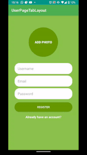

# UserTabLayout
An app that allows to register users using Firebase Authentication.
Registered users have a user page where they can add lists of their favorite songs, photos and videos.

## TabLayout material for easy navigation
Using TabLayout material together with ViewPagerAdapter the app can quickly navigate between fragments.


## Songs List
In a recycler view the songs picture, name and artist are displayed. 
When you click on the song a webView with a YoutubeMusic search for the song name and artist is inflated on a new activiy.
Using the floating button you can add a new song. This will display a new fragment where you can select and crop a picture you want to assign, plus the name and artist of the song.


When you swipe on the song item you can edit the song.
Or you can choose to delete it


## Photos List
In a recycler view with a grid layout the list of photos is displayed.
You can click on the image to have a better look at it, and if you desire delete it.
Using the floating button you can add a new picture too, either taking a new one with the phone camera or upload an existing one. 


(Notice how the floating button function changes on which fragment is currently active)

```
//set up click  listener on add button depending on the current tab
        binding.buttonAddAction.setOnClickListener {
            val position = binding.viewPager.currentItem

            when (position) {
                0 -> {
                    //Music Fragment
                    val navController = activity?.findNavController(R.id.myNavHostFragment)
                    navController?.navigate(R.id.action_homeFragment_to_add_new_song)
                }

                1 -> {
                    //Photos Fragment
                    val intent = Intent(Intent.ACTION_PICK)
                    intent.type = "image/*"
                    startActivityForResult(intent, 0)
                }

                2 -> {
                    //Videos Fragment
                    val intent1 = Intent(activity, YoutubeSearchActivity::class.java)
                    startActivity(intent1)
                }
            }

        }
        
```

## Videos List
In a recycler view with a grid layout the list of videos is displayed.
When you click on the video the video is played inside a webview using YouTube Android Player API.
Video can be deleted by long clicking on the video's image.
You can add a new video by clicking the floating button, this will activate a Youtube search on a new webview.
When a video is played it can be added to your list by clicking the save video at the button of the view. 


This is made possible by using a pattern recognition algorithm that looks for the video ID inside the current url being displayed.


```
private fun getVideoId(@NonNull videoUrl: String): String? {
        //Create patten to extract video ID
        val reg: String =
            "http(?:s)?:\\/\\/(?:m.)?(?:www\\.)?youtu(?:\\.be\\/|be\\.com\\/(?:watch\\?(?:feature=youtu.be\\&)?v=|v\\/|embed\\/|user\\/(?:[\\w#]+\\/)+))([^&#?\\n]+)"
        val pattern = Pattern.compile(reg, Pattern.CASE_INSENSITIVE);
        val matcher = pattern.matcher(videoUrl)

        if (matcher.find()) {
            return matcher.group(1)
        } else {
            return null
        }

    }
```
It also finds and uploads the video's thumbnail.
```
val videoImage = "https://img.youtube.com/vi/$videoID/0.jpg";
```


## User Settings
The user can change the profile picture,display name, email or password.
In order to save the changes the user must reauthenticate by entering the current email and password


## User Registering and Login
A new user can be registered, with and emai, password, username and a selected and cropped picture.




* Remember to add your own Firebase & Youtube Android Player API credentials when you test the app
